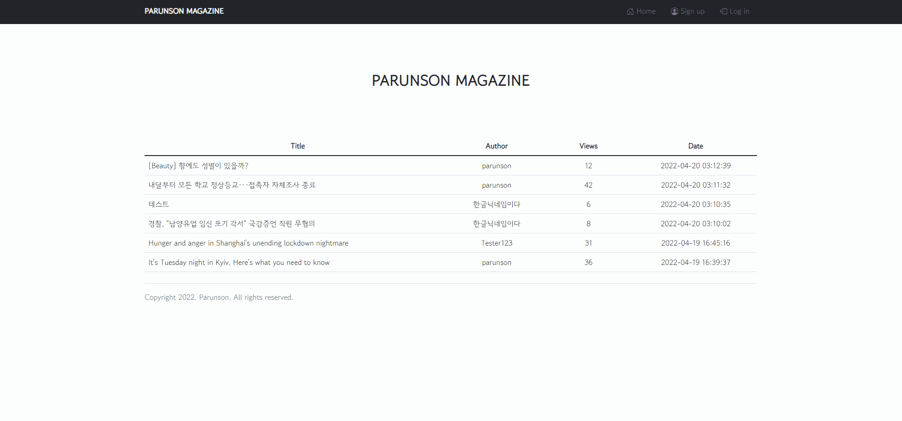

# 💾프로젝트명: mymagazine
springboot-gradle-project, Magazine site, for CRUD practice pjt.  
Springboot(Gradle)로 작성한 프로젝트입니다.  
Springboot 사용법 숙지 및 기본적인 CRUD를 구현하기 위해 간단한 매거진 사이트를 만들어보았습니다.

## 🖥운영 홈페이지
[운영 홈페이지(클릭)](http://3.38.106.41/)

## 📄미리 보기

## 🙄Session VS Token   
본 프로젝트에서는 인증 및 인가 방식으로 Session을 채택했습니다.   
   
그 이유로 이번에는 유저 계정을 보다 잘 관리하고 싶었고,   
유저별로 사용할 수 있는 기능을 달리 제공하고 싶었기때문에   
로그인 된 유저의 모든 정보를 서버에 저장하는 Session 방식이 적합하다 생각했습니다.   
   
예) **로그인 한 유저**는 상단 메뉴바의 로그인, 회원가입 메뉴를 볼 수 없는 대신, 로그아웃 기능을 사용할 수 있습니다.   
또한, 전체글 조회, 글쓰기, 글수정, 글삭제, 좋아요&좋아요 취소 기능을 사용할 수 있습니다.   
**비로그인한 유저**는 상단 메뉴바의 로그인, 회원가입 메뉴를 선택할 수 있지만, 로그아웃 탭을 볼 수 없습니다.   
비로그인한 유저라도 전체 글 조회 및 특정 게시글 열람이 가능하지만, 좋아요 기능은 사용할 수 없습니다.   
   
두번째 이유로는 연습용 프로젝트인만큼 본 서비스를 이용할 유저의 수가 극히 적을 것으로 예상되며,   
그러므로 DB에 부하가 갈만한 액션이 없을 것이기에 굳이 Token을 이용한 인증&인가 방식을 채택하지 않아도 좋겠다고 판단했습니다.   
   
   
